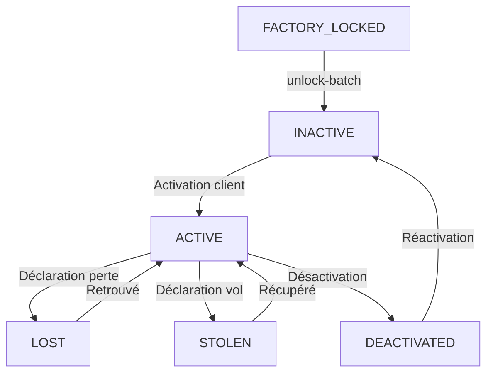

# 🔄 Workflow des Statuts de Bracelets

## 📊 Statuts Disponibles

```typescript
export type BraceletStatus =
  | 'FACTORY_LOCKED'  // En transit usine
  | 'INACTIVE'        // Prêt à activer
  | 'ACTIVE'          // Activé et lié à un profil
  | 'LOST'            // Déclaré perdu
  | 'STOLEN'          // Déclaré volé
  | 'DEACTIVATED'     // Désactivé
```

---

## 🎯 Cycle de Vie Normal

### 1. FACTORY_LOCKED (Création)

**Quand** : Lors de la génération du lot (script `generate-china-batch.js`)

**Caractéristiques** :
- Bracelet gravé mais en transit
- QR code imprimé sur le bracelet physique
- Document créé dans Firestore
- Token secret généré

**Comportement au scan** :
```
Scan → Page "🔧 MAINTENANCE"
"Ce bracelet n'est pas encore disponible"
```

**Durée** : 15-30 jours (transport Chine → Ouagadougou)

---

### 2. INACTIVE (Déblocage)

**Quand** : Réception des bracelets + QA validée

**Commande** :
```bash
npm run unlock-batch LOT_CHINA_001
```

**Opération** : `FACTORY_LOCKED` → `INACTIVE`

**Caractéristiques** :
- Bracelet en stock
- Prêt à être vendu
- Pas encore attribué à un client
- Aucun profil lié

**Comportement au scan** :
```
Scan → Redirection /activate?id=BF-XXX&token=...
Page d'activation pour le parent
```

**Durée** : Variable (temps en stock avant vente)

---

### 3. ACTIVE (Activation)

**Quand** : Client active le bracelet via l'app

**Opération** : `INACTIVE` → `ACTIVE`

**Caractéristiques** :
- Bracelet lié à un utilisateur (parent)
- Bracelet lié à un profil enfant
- Données médicales renseignées
- Mode urgence fonctionnel

**Comportement au scan** :
```
Scan → Page Mode Urgence
Affichage :
- Nom de l'enfant
- Photo
- Groupe sanguin
- Allergies
- Contacts d'urgence
```

**Durée** : Indéterminée (tant que le bracelet est utilisé)

---

## ⚠️ Statuts Exceptionnels

### LOST (Perdu)

**Quand** : Parent déclare le bracelet perdu

**Opération** : `ACTIVE` → `LOST`

**Comportement au scan** :
```
Scan → Page Mode Urgence (normal)
+ Notification au parent : "Votre bracelet a été scanné"
+ Possibilité de géolocalisation (si implémenté)
```

**Utilité** : Retrouver un enfant perdu

---

### STOLEN (Volé)

**Quand** : Parent déclare le bracelet volé

**Opération** : `ACTIVE` → `STOLEN`

**Comportement au scan** :
```
Scan → Page "⚠️ BRACELET SIGNALÉ"
"Ce bracelet a été déclaré perdu ou volé"
"Cette tentative d'accès a été enregistrée"
```

**Utilité** : Piège pour dissuader le vol

---

### DEACTIVATED (Désactivé)

**Quand** :
- Transfert de bracelet à un autre enfant
- Archivage (enfant devenu trop grand)
- Résiliation de service

**Opération** : `ACTIVE` → `DEACTIVATED`

**Comportement au scan** :
```
Scan → Page d'erreur ou redirection /activate
(À définir selon besoin)
```

---

## 🔄 Transitions Possibles



---

## 📋 Tableau Récapitulatif

| Statut | Scan → Résultat | Qui peut changer | Comment |
|--------|----------------|------------------|---------|
| **FACTORY_LOCKED** | Page maintenance | Admin | `npm run unlock-batch` |
| **INACTIVE** | Redirection /activate | Client | Via app (activation) |
| **ACTIVE** | Mode urgence | Parent | Via dashboard (perte/vol) |
| **LOST** | Mode urgence + notif | Parent | Via dashboard (retrouvé) |
| **STOLEN** | Page piège | Parent | Via dashboard (récupéré) |
| **DEACTIVATED** | TBD | Admin/Parent | Via dashboard |

---

## 🎯 Pour le LOT CHINA 001

### État Actuel
```
120 bracelets en statut FACTORY_LOCKED
```

### Prochaine Étape
```bash
# Après réception et QA
npm run unlock-batch LOT_CHINA_001

# Résultat : 120 bracelets passent en INACTIVE
```

### Après Déblocage
```
Scan → Redirection vers /activate
Les clients pourront activer leurs bracelets
```

---

## ⚠️ IMPORTANT

**Il n'existe PAS de statut "PROVISIONED"**

La documentation précédente mentionnait incorrectement un statut `PROVISIONED`.
Le workflow correct est :

```
✅ FACTORY_LOCKED → INACTIVE → ACTIVE
❌ FACTORY_LOCKED → PROVISIONED → INACTIVE
```

Toute mention de "PROVISIONED" dans la documentation est une erreur et doit être
comprise comme "INACTIVE".

---

**Date de création** : 28 Novembre 2025
**Version** : 1.0 (Correction workflow)
